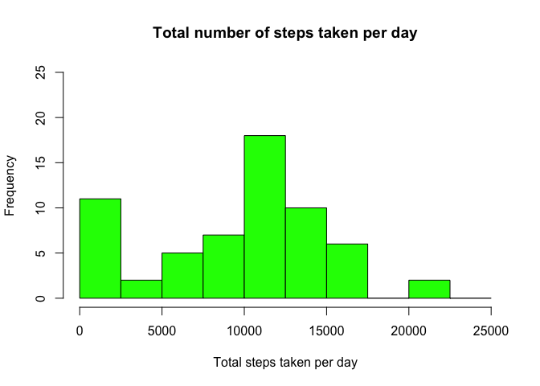
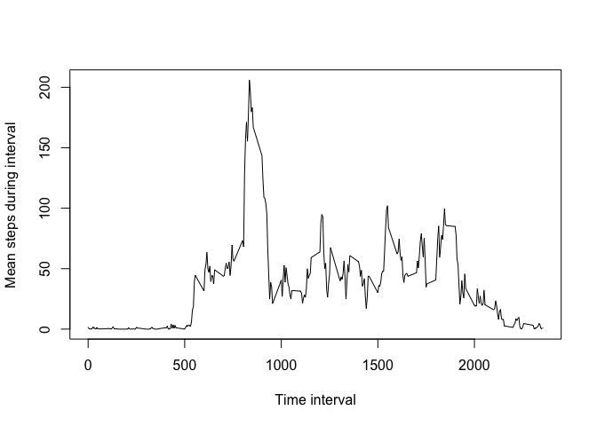
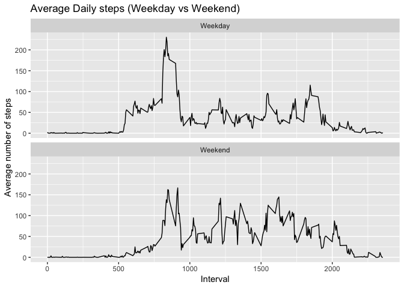

---
title: "Reproducible_Research_Project1"
author: "Saifeel Momin"
date: "February 24, 2019"
output: 
  html_document:
    keep_md: true
--- 

# Instructions

1. Loading and preprocessing the data
2. What is mean total number of steps taken per day?
3. What is the average daily activity pattern?
4. Imputing missing values
5. Are there differences in activity patterns between weekdays and weekends?

## Step 1

## Loading and preprocessing the data

```r
library(ggplot2)
setwd("~//Desktop/datasciencecoursera/RepRes project 1")
main0 <- read.csv("activity.csv", header = TRUE)
```
Getting familiar with the data 

```r
head(main0)
```

```
##   steps       date interval
## 1    NA 2012-10-01        0
## 2    NA 2012-10-01        5
## 3    NA 2012-10-01       10
## 4    NA 2012-10-01       15
## 5    NA 2012-10-01       20
## 6    NA 2012-10-01       25
```

```r
str(main0)
```

```
## 'data.frame':	17568 obs. of  3 variables:
##  $ steps   : int  NA NA NA NA NA NA NA NA NA NA ...
##  $ date    : Factor w/ 61 levels "2012-10-01","2012-10-02",..: 1 1 1 1 1 1 1 1 1 1 ...
##  $ interval: int  0 5 10 15 20 25 30 35 40 45 ...
```

## Step 2

## What is mean total number of steps taken per day?

### Calculate the total number of steps taken per day

```r
sums <- aggregate(main0$steps, by = list(main0$date), sum, na.rm = TRUE)
colnames(sums) = c("date", "steps")
head(sums)
```

```
##         date steps
## 1 2012-10-01     0
## 2 2012-10-02   126
## 3 2012-10-03 11352
## 4 2012-10-04 12116
## 5 2012-10-05 13294
## 6 2012-10-06 15420
```

### Make a histogram of the total number of steps taken each day

```r
hist(sums$steps, main = "Total number of steps taken per day", 
     xlab = "Total steps taken per day", col = "green", ylim = c(0,25), 
     breaks = seq(0,25000, 2500))
```

<!-- -->

### Calculate and report the mean and median of the total number of steps taken per day


```r
means <- mean(sums$steps, na.rm = TRUE)
medians <- median(sums$steps, na.rm = TRUE)
print(means)
```

```
## [1] 9354.23
```

```r
print(medians)
```

```
## [1] 10395
```
The calculated mean total number of steps taken per day is 9354.2295082 and the median value is 10395.

## Step 3
## What is the average daily activity pattern?
### Make a time series plot (i.e. type="l") of the 5-minute interval (x-axis) and the average number of steps taken, averaged across all days (y-axis)

```r
imeans <- aggregate(main0$steps, by = list(main0$interval), mean, na.rm = TRUE)
plot(imeans$Group.1, imeans$x, type = "l", xlab = "Time interval", ylab ="Mean steps during interval")
```

<!-- -->

### Which 5-minute interval, on average across all the days in the dataset, contains the maximum number of steps?

```r
imax <- imeans[which.max(imeans$x), ]$Group.1
print(imax)
```

```
## [1] 835
```
The 5-minute interval on average across all days in the daataset with the maximum numer of steps is 835.

## Step 4 

## Imputing missing values

### Calculate and report the total number of missing values in the dataset (i.e.NAs)


```r
nans <- sum(is.na(main0$steps))
print(nans)
```

```
## [1] 2304
```

The number of missing values in the dataset is 2304.

### Create a new dataset that is equal to the original dataset but with the missing data filled in.


```r
main0$stepsi <- main0$steps
impsteps <- imeans$x[match(main0$interval, imeans$Group.1)]
impMain <- transform(main0, stepsi = ifelse(is.na(main0$stepsi), yes = impsteps, no = main0$stepsi))
head(impMain)
```

```
##   steps       date interval    stepsi
## 1    NA 2012-10-01        0 1.7169811
## 2    NA 2012-10-01        5 0.3396226
## 3    NA 2012-10-01       10 0.1320755
## 4    NA 2012-10-01       15 0.1509434
## 5    NA 2012-10-01       20 0.0754717
## 6    NA 2012-10-01       25 2.0943396
```

### Make a histogram of the total number of steps taken each day 


```r
isteps <- aggregate(impMain$stepsi,by = list(impMain$date), sum)
hist(isteps$x, main = "Total number of steps taken per day", 
     xlab = "Total steps taken per day", col = "yellow", ylim = c(0,30), xlim = c(0,25000), 
     breaks = seq(0,25000, 2500))
```

<!-- -->

### Calculate and report the mean and median total number of steps taken per day. Do these values differ from the estimates from the first part of the assignment? What is the impact of imputing missing data on the estimates of the total daily number of steps?


```r
impmeans <- mean(isteps$x)
impmedian <- median(isteps$x)
Means <- data.frame(means, impmeans)
Medians <- data.frame(medians, impmedian)
MM <- cbind(Means, Medians)
colnames(MM) <- c("Mean", "Mean (Imputed)", "Median", "Median (Imputed)")
print(MM)
```

```
##      Mean Mean (Imputed) Median Median (Imputed)
## 1 9354.23       10766.19  10395         10766.19
```


## Step 5 

## Are there differences in activity patterns between weekdays and weekends?

### Create a new factor variable in the dataset with two levels – “weekday” and “weekend” indicating whether a given date is a weekday or weekend day.

```r
impMain$date <- as.Date(strptime(impMain$date, format = "%Y-%m-%d"))
impMain$wkday <- sapply(impMain$date, FUN = function(x){
  if(weekdays(x) == "Saturday" | weekdays(x) == "Sunday"){
      z <- "Weekend"
    }
  else{
      z <- "Weekday"
    }
  z
  })

head(impMain)
```

```
##   steps       date interval    stepsi   wkday
## 1    NA 2012-10-01        0 1.7169811 Weekday
## 2    NA 2012-10-01        5 0.3396226 Weekday
## 3    NA 2012-10-01       10 0.1320755 Weekday
## 4    NA 2012-10-01       15 0.1509434 Weekday
## 5    NA 2012-10-01       20 0.0754717 Weekday
## 6    NA 2012-10-01       25 2.0943396 Weekday
```
 
### Make a panel plot containing a time series plot of the 5-minute interval (x-axis) and the average number of steps taken, averaged across all weekday days or weekend days (y-axis)


```r
wkmeans <- aggregate(impMain$stepsi, by = list(impMain$interval, impMain$wkday), mean)
colnames(wkmeans) <- c("interval", "wkday", "steps")

g <- ggplot(wkmeans, aes(x=interval, y=steps)) + geom_line() + 
  facet_wrap(.~wkday,nrow = 2) + ggtitle("Average Daily steps (Weekday vs Weekend)") +
  labs(x = "Interval", y = "Average number of steps")
print(g) 
```

<!-- -->


